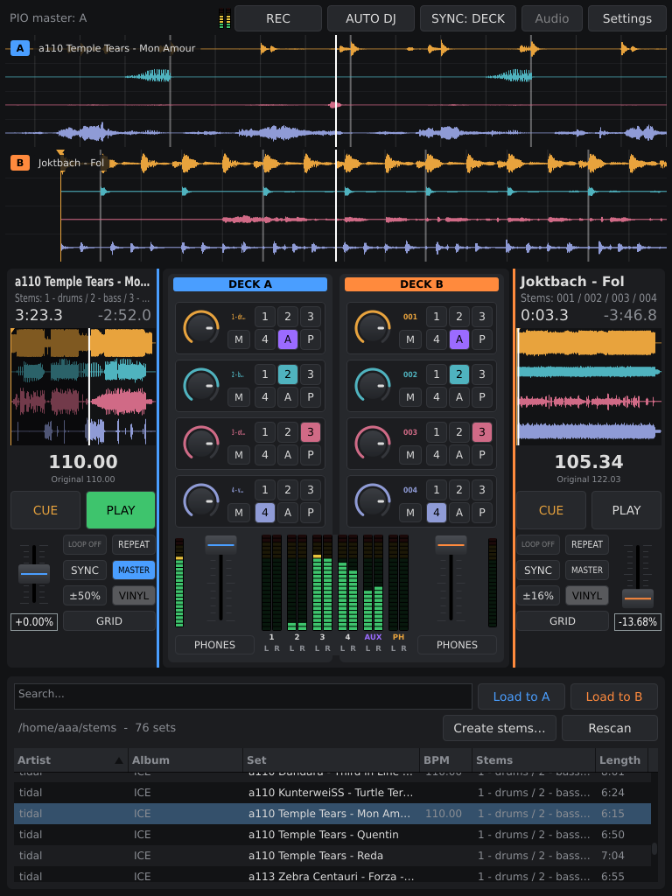
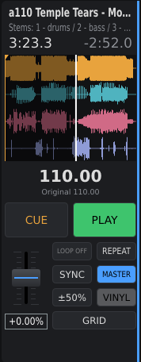
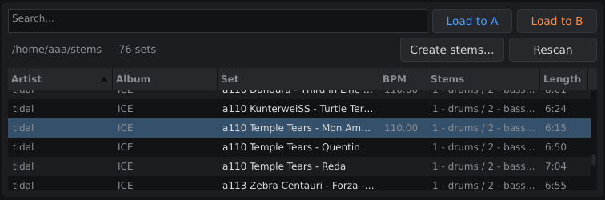

# StemDeck

A stem player for DJs: two decks, each playing a track split into four stereo stems, and a
mixer that sends every stem to its own output bus.

StemDeck is part of the [A³ Audio](https://github.com/a3-audio) system, a live 3D/ambisonics
setup. Its four stem buses and the aux bus feed A³ Core, where a stem sent to aux can be put onto
a movement and flown around the room.

<!-- IMAGE: the whole main window with a set loaded on both decks, one of them playing -->


---

## Stem sets

A set is exactly four audio files in one folder that share a name prefix and differ only in the
part after the last space, `-` or `_`:

```
Artist - Title-001.wav  …  Artist - Title-004.wav
Artist - Title - 01.wav …  Artist - Title - 04.wav
Artist - Title - DUB.wav, … - KICK.wav, … - PADS.wav, … - PERC.wav
```

The suffixes are sorted naturally (`01` before `10`, and words alphabetically), and stem N goes
to bus N. A group with three or five files is not a set and does not show up. Any format JUCE
reads out of the box works (WAV, AIFF, FLAC, Ogg Vorbis); WAV and AIFF are memory-mapped, which
makes seeking and looping instant.

The library scans its folder recursively. It starts in `./stems` (relative to where StemDeck was
started) and remembers the last folder you picked.

---

## The screen

Scrolling waveforms of both decks across the top, deck A | mixer | deck B in the middle, the
library at the bottom. The top bar shows the audio status (JACK client, rate, buffer, connected
ports, xruns) and the SYNC source. Some on-screen labels are still German.

### Decks

<!-- IMAGE: one deck close-up: title, overview waveform with a loop set, CUE/PLAY, jog wheel, BPM readout with "Original", SYNC, range button, tempo fader -->


Laid out like a CDJ:

- **CUE** works like a CDJ (Mixxx's CDJ mode): while playing, it jumps back to the cue point and
  stops; while stopped, it sets the cue point, or, if already on it, plays for as long as it is
  held.
- **PLAY** starts and pauses.
- **Overview waveform** (four stem lanes): click to jump, drag to set a loop. **LOOP AUS** clears
  it; **REPEAT** starts the track over at its end.
- **Jog wheel**: in **VINYL** mode the platter scratches, forwards or backwards; the outer ring
  bends the pitch while playing and searches while stopped. The mouse wheel nudges or fine-searches.
- **Tempo fader** with a range button cycling ±8 / ±16 / ±50 %.
- **BPM**: the current tempo, with the track's own tempo ("Original") below. It comes from a
  tempo analysis that runs in the background when a set is loaded; it assumes a constant tempo,
  sums all four stems, and caches its result, so each set is analysed once.
- **SYNC**: see [Sync](#sync).

The scrolling waveforms scroll past a fixed playhead; drag to move through the track, mouse wheel
to zoom.

### Mixer

<!-- IMAGE: the mixer between the decks: both channel strips with stem knobs, M and AUX buttons (one AUX lit), channel faders, and the output meters 1-4 / AUX -->


One channel strip per deck. Per stem: a gain knob (−60 to +6 dB, double-click for 0 dB), **M**
(mute) and **AUX**, which takes the stem off its bus and sends it, post fader, to the aux bus
instead. Below, the channel fader. In the middle, output meters for buses 1–4 and AUX.

### Library

<!-- IMAGE: the library with a few sets listed, BPM column filled, the search box and the "Laden in A / Laden in B" buttons -->


Columns: set, BPM (once analysed), stem names, length, folder; click a header to sort. The search
box filters as you type. Load a set with the **Laden in A / B** buttons, by double-click or Return
(first deck that is not playing), or by dragging a row onto a deck or its waveform.

### Keyboard

| Key | Deck A | Deck B |
|---|---|---|
| Play / pause | `D` | `L` |
| Cue (hold to preview) | `S` | `K` |
| Mute stem 1–4 | `1` `2` `3` `4` | `7` `8` `9` `0` |

---

## Audio output

StemDeck is a JACK client named `StemDeck` with 10 output ports:

```
deck1_L deck1_R … deck4_L deck4_R   bus N = stem N of deck A + stem N of deck B
aux_L   aux_R                        every stem switched to AUX
```

- The ports are **never connected automatically**. Route them with qjackctl, a patchbay or
  whatever you like.
- StemDeck never starts a JACK server. `./start.sh` uses a running `jackd`/`jackdbus`; if there is
  none but PipeWire is running, it starts StemDeck through `pw-jack`. Without either, StemDeck
  falls back to a regular audio device (ALSA), chosen with the **Audio-Einstellungen** button; with
  fewer than 10 outputs the buses are summed down onto the ones there are.
- It takes the graph's sample rate and buffer size as they are and resamples the stems itself. It
  requests nothing on purpose — changing a running graph ends clients like zita-j2n. Set the rate
  beforehand if it matters, e.g. for PipeWire (until restart):

  ```sh
  pw-metadata -n settings 0 clock.force-rate 44100
  ```

---

## Sync

<!-- IMAGE: the top bar, right side: the PIO status readout (e.g. "PIO 128.0 · CDJ 2"), the CDJ player box if visible, the "SYNC: PIO" button and "Audio-Einstellungen" -->


The **SYNC: DECK | PIO** button in the top bar chooses what SYNC on a deck follows. Switching it
turns off every SYNC that was on.

Both sources follow with the same rules: the tempo is the leader's times half, same or double —
whichever needs the smallest change, chosen once when SYNC goes on — and the tempo range widens
if it has to. The phase is only corrected while both play and nobody scratches: more than 50 ms
off jumps into phase, closer is nudged by at most 2 %.

### DECK

One deck follows the other. SYNC on deck A makes A follow B; pressing SYNC on B hands the role
over.

### PIO: following the CDJs

SYNC follows the Pioneer Pro DJ Link tempo master: its tempo (BPM including pitch) and its beat.
Both decks may be synced at once, each with its own half/same/double choice.

- StemDeck joins the network as virtual CDJ **number 6** (setting `pioDevice` in
  `~/.config/StemDeck/StemDeck.settings`) and listens on UDP 50000–50002. The sockets use
  `SO_REUSEADDR`, so it can share a machine with beat-analyzer (number 7) and both get the
  broadcast beats. If the network is not up yet, it retries every two seconds.
- The master comes from the CDJs' status packets. Some of those go to one address only, so on a
  machine shared with beat-analyzer they may not arrive. After two seconds without them the
  readout says **no master** and StemDeck follows the player chosen in the box beside it (by
  default the first one it heard).
- If the master falls silent, the tempo is held (readout: **held**) and the phase left alone
  until beats return.
- It aligns the **beat, not the bar**: the track's grid knows beats, not where the "1" is. Set
  the downbeat with the jog, as on a CDJ.

---

### MASTER: StemDeck as the tempo master

No CDJs on the link? Then StemDeck is the CDJ. Each deck has a **MASTER** button, as on a CDJ:
the master deck's beat goes out to the Pioneer network, and anything following the Pro DJ Link
tempo master follows StemDeck — in the A³ system that is beat-analyzer in clock mode 2, which
passes the beat on to A³ Motion.

- Press MASTER on a deck to make it master; press it on the other deck to hand over; press it on
  the master to turn MASTER off (StemDeck then leaves the Pioneer network if it is not
  following either). With no master chosen, the only playing deck becomes master by itself —
  but not under **SYNC: PIO** (a real CDJ may hold master, and two masters would flip every
  listener's clock) and not once MASTER was turned off by hand.
- StemDeck sends, as virtual CDJ 6: a **beat packet on every beat** of the master deck (tempo =
  the track's BPM × the tempo fader, beat in the bar counted from the grid's first beat) and a
  **status packet every 200 ms** (master, playing or not, tempo, beat). A stopped master stays
  master and simply sends no beats.
- Everything goes out as **broadcast**, so a listener on the same machine hears it whichever
  program started first (unicast would reach only one of them).
- A separate thread times the beats to about a millisecond, from the deck's position carried to
  "now"; the 60 Hz screen timer would be up to 16 ms off. A beat is never lost to a late wake-up,
  a cue on a beat sends that beat when you press PLAY, a jump sends no burst of skipped beats, and
  a handover never doubles a beat.
- Nothing is sent while the master deck has no tempo grid yet (still being analysed).
- The readout in the top bar says `PIO master: A` (or B) while StemDeck sends.
- The packets follow the layout [prolink-connect](https://github.com/EvanPurkhiser/prolink-connect)
  reads, so tools built on it (e.g. prolink-tools) see StemDeck like a CDJ.

## Build and run

Linux. You need:

- **CMake** ≥ 3.22, a C++17 compiler, **pkg-config**
- **JUCE 9**, installed so that `find_package(JUCE)` finds it, plus JUCE's own Linux build
  dependencies (X11, freetype, …; see JUCE's `docs/Linux Dependencies.md`). `start.sh` looks
  under `~/local/juce` unless `CMAKE_PREFIX_PATH` is set. To install it there from a JUCE
  checkout:

  ```sh
  cmake -S . -B build -DCMAKE_INSTALL_PREFIX=$HOME/local/juce
  cmake --build build --target install
  ```

- via pkg-config: `jack`, `flac`, `vorbisenc`, `vorbisfile`, `vorbis`, `ogg`. On Debian:

  ```sh
  apt install libjack-jackd2-dev libflac-dev libvorbis-dev libogg-dev
  ```

- **GoogleTest** (`libgtest-dev`), only for the tests.

Then:

```sh
./start.sh
```

It configures a Release build in `build/` on the first run (CMake's default generator, so no
Ninja needed), rebuilds incrementally when something changed, and starts StemDeck with the JACK /
`pw-jack` / ALSA choice described above. The binary is
`build/StemDeck_artefacts/Release/StemDeck`.

Settings (library folder, sync source, audio device) live in `~/.config/StemDeck/`, next to
`analysis.xml`, the tempo analysis cache.

### Tests

The Pro DJ Link parser, the Pioneer clock and the follow rules are pure code with unit tests:

```sh
export CMAKE_PREFIX_PATH=$HOME/local/juce   # the top-level CMakeLists still needs JUCE
cmake -S . -B build -DSTEMDECK_TESTS=ON
cmake --build build --target stemdeck-tests   # or without --target: app and tests
ctest --test-dir build
```

`ctest` runs what was built; it does not build. Tests live in `tests/`.
